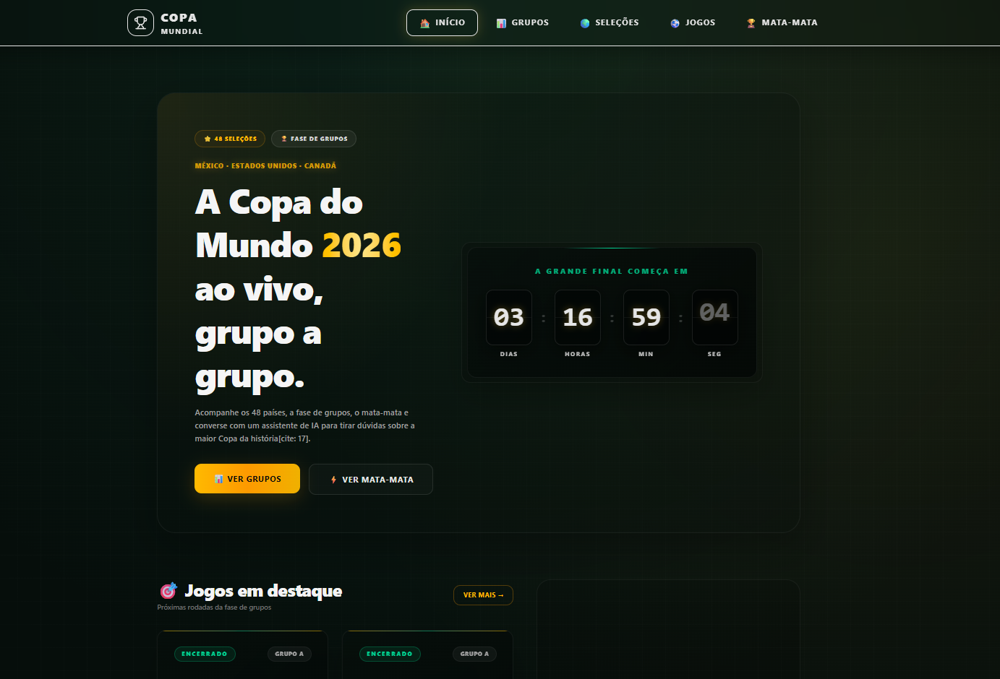
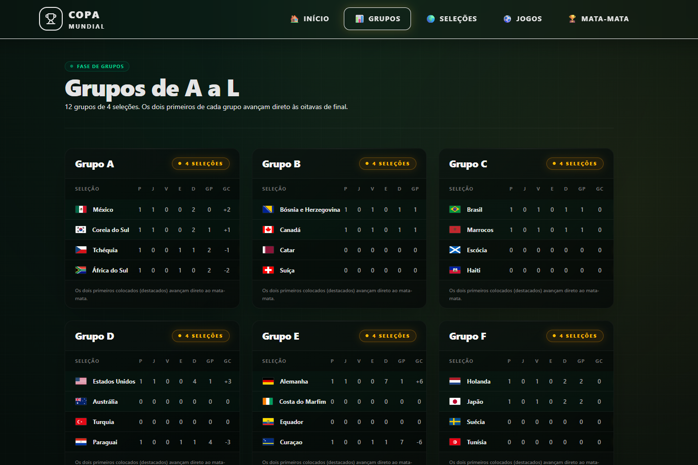
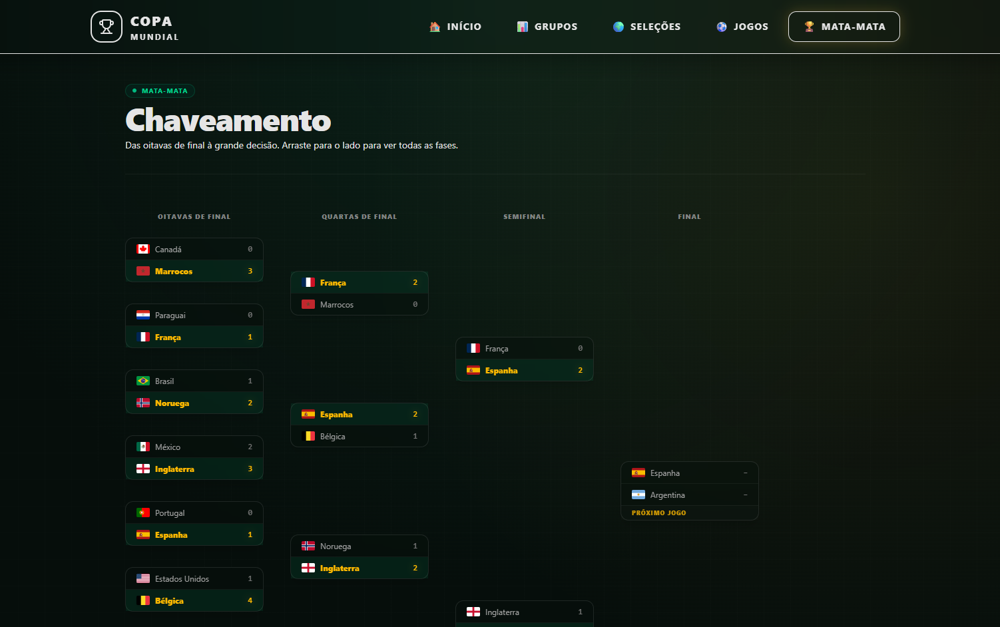

#  🏆 Copa 2026 App

Aplicação web construída em **React + TypeScript** para acompanhar a Copa do Mundo FIFA 2026, sediada nos Estados Unidos, México e Canadá. O projeto reúne grupos, seleções, jogos, chaveamento do mata-mata e um contador regressivo para o início do torneio.


<!-- Substitua pelo link do seu deploy e por um screenshot real do projeto -->

🔗 **Demo:** [worldcup2026-app](https://worldcup2026-app-two.vercel.app/)


---

## ✨ Funcionalidades

- ⏱️ Contador regressivo para a abertura da Copa
- 🌎 Visualização dos grupos e classificação
- ⚽ Lista de jogos com filtro por data, seleção e estádio
- 🏟️ Detalhes de seleções (elenco, bandeira, histórico)
- 🥇 Chaveamento interativo do mata-mata
- ⭐ Sistema de favoritos (seleção "do coração" salva localmente)
- 🌗 Modo claro / escuro
- 📱 Totalmente responsivo (mobile-first)

---

## 🧱 Stack utilizada

| Categoria           | Tecnologia                  |
| ------------------- | --------------------------- |
| Build tool          | [Vite](https://vitejs.dev/) |
| Linguagem           | TypeScript                  |
| UI                  | React 18                    |
| Estilização         | Tailwind CSS                |
| Animações           | Framer Motion               |
| Roteamento          | React Router DOM            |
| Cache/dados remotos | TanStack Query              |
| Estado global       | Zustand                     |
| Ícones              | Lucide React                |
| Deploy              | Vercel                      |

---

## 📁 Estrutura de pastas

```
src/
├── assets/            # imagens, bandeiras e ícones
├── components/
│   ├── layout/         # Header, Footer, Navbar
│   └── ui/              # componentes reutilizáveis (Button, Card, Badge)
├── pages/              # páginas de rota (Home, Groups, Teams, Matches...)
├── hooks/              # hooks customizados (useCountdown, useMatches)
├── data/               # mock de dados da Copa (grupos, seleções, jogos)
├── services/           # chamadas de API
├── store/              # estado global (Zustand)
├── types/              # tipagens TypeScript
├── App.tsx
└── main.tsx
```

---

## 🚀 Como rodar localmente

```bash
# clone o repositório
git clone https://github.com/seu-usuario/copa2026-app.git
cd copa2026-app

# instale as dependências
npm install

# crie o arquivo de variáveis de ambiente
cp .env.example .env

# rode em modo desenvolvimento
npm run dev
```

O projeto estará disponível em `http://localhost:5173`.

### Scripts disponíveis

| Comando           | Descrição                            |
| ----------------- | ------------------------------------ |
| `npm run dev`     | Inicia o servidor de desenvolvimento |
| `npm run build`   | Gera a build de produção             |
| `npm run preview` | Pré-visualiza a build de produção    |
| `npm run lint`    | Roda o linter                        |
| `npm run test`    | Executa os testes                    |

---

## 🔑 Variáveis de ambiente

```env
VITE_API_BASE_URL=https://api.exemplo.com
VITE_API_KEY=sua_chave_aqui
```

> Caso não configure uma API externa, o projeto funciona com dados mockados em `src/data/worldcup2026.json`.

---

## 🧪 Testes

```bash
npm run test
```

Testes escritos com **Vitest** + **Testing Library**, cobrindo componentes-chave como `MatchCard`, `GroupTable` e `CountdownTimer`.

---

## 🗺️ Roadmap

- [ ] Internacionalização (PT-BR / EN / ES)
- [ ] Integração com API real de estatísticas ao vivo
- [ ] PWA (uso offline)
- [ ] Página de estatísticas por jogador
- [ ] Testes E2E com Playwright

---

## 🖼️ Screenshots

| Home | Grupos | Chaveamento |
| :---: | :---: | :---: |
|  |  |  |
---

## 🤝 Contribuindo

Contribuições são bem-vindas!

1. Faça um fork do projeto
2. Crie uma branch (`git checkout -b feature/nova-feature`)
3. Commit suas mudanças (`git commit -m 'feat: adiciona nova feature'`)
4. Push para a branch (`git push origin feature/nova-feature`)
5. Abra um Pull Request

---

## 📄 Licença

Este projeto está sob a licença MIT. Veja o arquivo [LICENSE](./LICENSE) para mais detalhes.

---

## 👤 Autor

Desenvolvido por **@devbdallagnol**

[](https://linkedin.com/in/seu-usuario)
[](https://github.com/seu-usuario)
